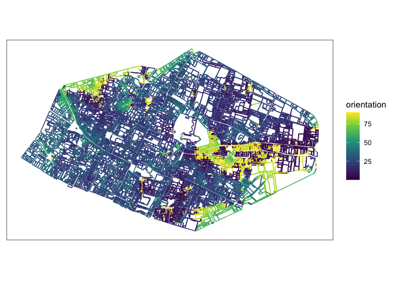
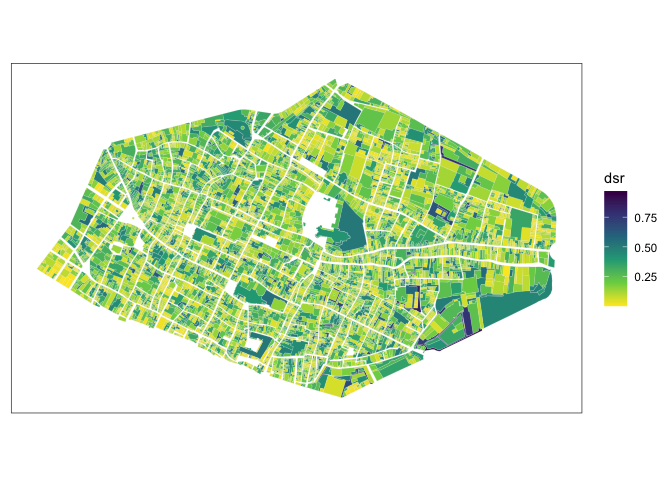
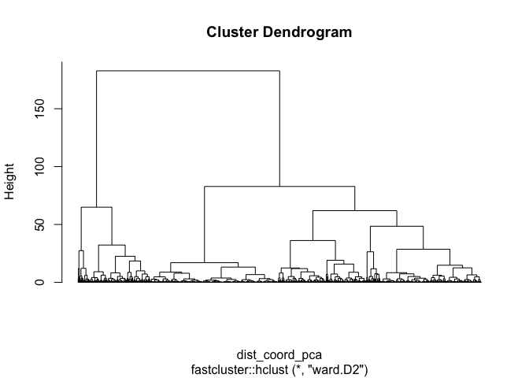
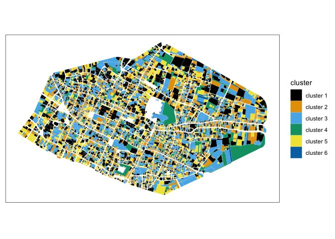

## package development

[](https://www.gnu.org/licenses/gpl-3.0)
 


## morphalr: Morphological Analysis for Archaeology

A package to compute morphological indices of spatial entities
(e.g. parcels, buildings). It also provides visuals of multivariate
statistics results (ACP and HCA).

## Installing

Package currently exist as development on github.

Install package from github:

``` r
library(remotes)
install_github(repo = "JGravier/morphalr")
```

## Compute orientations from polygon

Load data of parcels of the city of Rouen in 1827 and extract segments
(lines) from polygons.

``` r
library(tidyverse)
library(sf)
library(kableExtra)
library(morphalr)

# transform polygons as segments (lines)
linerouen <- morphalr_geom_to_segment(sfobject = rouen_1827, to = 'LINESTRING')
```

`morphal_geom_to_segment()` can be applied on LINESTRING, e.g. in the
case of streets modeled as lines.

Compute orientations of segments with East looking and perpendicular
parameters.

``` r
orientationsest <- morphalr_segment_orientation(sfsegments = linerouen, looking = 'E', perpendicular = TRUE)

orientationsest |>
  ggplot() +
  geom_sf(aes(color = orientation)) +
  scale_color_viridis_c() +
  theme_bw() +
  theme(axis.ticks = element_blank(), axis.text = element_blank(), panel.grid = element_blank())
```

<!-- -->

## Compute morphological indices

Example with distance to minimal bounding rectangle (DSR):

``` r
rouen_1827 |>
  morphalr_dsr() |>
  ggplot() +
  geom_sf(aes(fill = dsr), color = 'grey90', linewidth = 0.05) +
  scale_fill_viridis_c(direction = -1) +
  theme_bw() +
  theme(axis.ticks = element_blank(), axis.text = element_blank(), panel.grid = element_blank())
```

<!-- -->

## Computing clusters from indices

Compute indices.

``` r
rouen_with_indices <- rouen_1827 |>
  morphalr_circularity() |>
  morphalr_dsc() |>
  morphalr_dsr()

rouen_with_indices <- rouen_with_indices[,2:5] # without rowid
rouen_with_indices
```

    ## Simple feature collection with 10240 features and 3 fields
    ## Geometry type: POLYGON
    ## Dimension:     XY
    ## Bounding box:  xmin: 560973.9 ymin: 6927999 xmax: 563141.3 ymax: 6929327
    ## Projected CRS: RGF93 v1 / Lambert-93
    ## # A tibble: 10,240 × 4
    ##                                           geometry miller_index       dsc    dsr
    ##                                      <POLYGON [m]>        <dbl>     <dbl>  <dbl>
    ##  1 ((561754.2 6928994, 561759.5 6928992, 561756.2…        0.690  0        0.174 
    ##  2 ((561779.4 6929002, 561773.6 6928982, 561764.7…        0.689 -3.19e-12 0.0625
    ##  3 ((561732.2 6928970, 561735.3 6928967, 561741.4…        0.247  2.30e- 1 0.405 
    ##  4 ((561715.6 6928974, 561708.7 6928977, 561705.1…        0.180  5.55e- 1 0.717 
    ##  5 ((561605.9 6928902, 561603.4 6928896, 561592.8…        0.719  0        0.0265
    ##  6 ((561604.7 6928915, 561607.3 6928914, 561614 6…        0.490  3.56e- 3 0.0603
    ##  7 ((561610.9 6928904, 561611.7 6928904, 561610 6…        0.493  2.79e- 4 0.0623
    ##  8 ((561621 6928889, 561612.5 6928867, 561608.2 6…        0.441  1.20e- 2 0.0711
    ##  9 ((561627.2 6928869, 561623 6928871, 561619.3 6…        0.773  6.85e- 3 0.0271
    ## 10 ((561628.3 6928906, 561621.3 6928890, 561616.4…        0.680  2.91e- 2 0.122 
    ## # ℹ 10,230 more rows

Create clustering and plot result:

``` r
clusterrouen <- morphalr_clustering(sf = rouen_with_indices, pca_center = TRUE, pca_scale = TRUE, hca_method = 'ward.D2')

plot(clusterrouen, labels = FALSE, hang = 0)
```

<!-- --> \### Clusters
Cartography of clusters:

``` r
morphalr_clusters(sf = rouen_with_indices, clustering = clusterrouen, cutting = 6) |>
  ggplot() +
  geom_sf(aes(fill = cluster), color = 'white', linewidth = 0.02) +
  ggthemes::scale_fill_colorblind() +
  theme_bw() +
  theme(axis.ticks = element_blank(), axis.text = element_blank(), panel.grid = element_blank())
```

<!-- -->

Summary of clusters with mean of center-scale values of variables by
cluster.

``` r
morphalr_clusters_mean(sf = rouen_with_indices, clustering = clusterrouen, cutting = 6)
```

    ## # A tibble: 6 × 4
    ##   cluster   miller_index     dsc    dsr
    ##   <fct>            <dbl>   <dbl>  <dbl>
    ## 1 cluster 1        0.623 0.0699  0.207 
    ## 2 cluster 2        0.582 0.00732 0.0685
    ## 3 cluster 3        0.441 0.188   0.348 
    ## 4 cluster 4        0.288 0.390   0.561 
    ## 5 cluster 5        0.746 0.00339 0.0607
    ## 6 cluster 6        0.324 0.0252  0.161

## Morphological indices

| Function name                  | Indices                                                   |     Implementation |
|:-------------------------------|:----------------------------------------------------------|-------------------:|
| morphalr_segment_orientation() | orientations of segments of polygons or lines             | :white_check_mark: |
| morphalr_dsr()                 | distance of polygons to their minimal bounding rectangles | :white_check_mark: |
| morphalr_dsc()                 | distance of polygons to their convex hull                 | :white_check_mark: |
| morphalr_circularity()         | Miller circularity index of polygons                      | :white_check_mark: |
| morphalr_complexity()          | morphological complexity of polygons                      | :white_check_mark: |
|                                | elongation (Schum)                                        |             :soon: |
|                                | spreading (Morton)                                        |             :soon: |
|                                | compacity (Thibault et al.)                               |             :soon: |
|                                | compactity 2 (Cauvin and Rimbert)                         |             :soon: |
|                                | compacity 3 (Gravelius)                                   |             :soon: |
|                                | stretching                                                |             :soon: |
|                                | area concavity                                            |             :soon: |
|                                | inverse of perimeter concavity                            |             :soon: |
